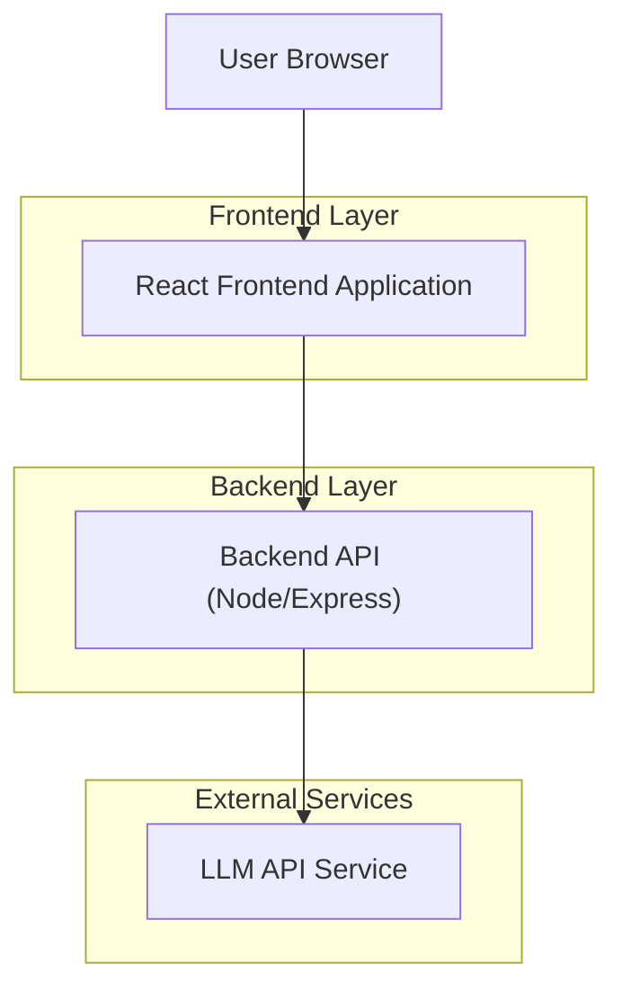
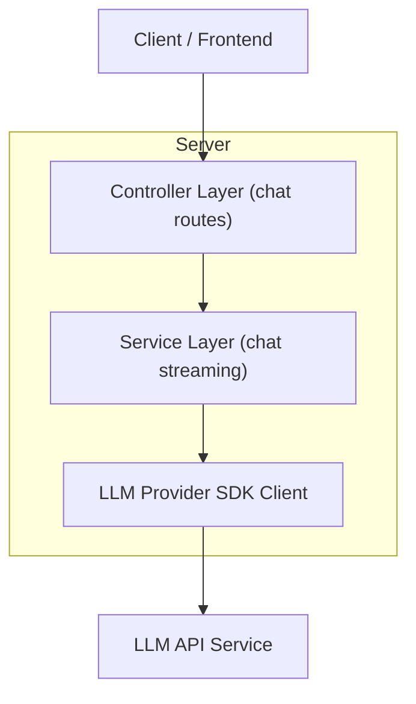

## 1.Architecture design


## 2.Technology Description
- Frontend: React@18 + TypeScript + vite + tailwindcss@3
- Backend: Node.js + Express (TypeScript)
- Streaming: Server-Sent Events (SSE) para enviar texto incremental del asistente al navegador

## 3.Route definitions
| Route | Purpose |
|-------|---------|
| / | Página de chat responsiva con entrada de usuario y caja de texto del asistente en tiempo real |

## 4.API definitions (If it includes backend services)
### 4.1 Core API
Generación de respuesta del asistente en streaming

```
POST /api/chat/stream
```

Request:
| Param Name| Param Type | isRequired | Description |
|----------|------------|------------|-------------|
| message | string | true | Texto del usuario a enviar al asistente |

Response (SSE):
| Event | Payload | Description |
|------|---------|-------------|
| chunk | {"delta": string} | Fragmento incremental de texto del asistente |
| done | {} | Señala finalización del stream |
| error | {"message": string} | Error legible para UI |

TypeScript (compartido):
```ts
export type ChatStreamRequest = {
  message: string;
};

export type ChatStreamChunkEvent = {
  delta: string;
};

export type ChatStreamErrorEvent = {
  message: string;
};
```

Notas de seguridad (mínimas):
- La API Key del proveedor LLM se mantiene solo en el backend (variable de entorno).
- El frontend nunca recibe ni almacena secretos.

## 5.Server architecture diagram (If it includes backend services)

