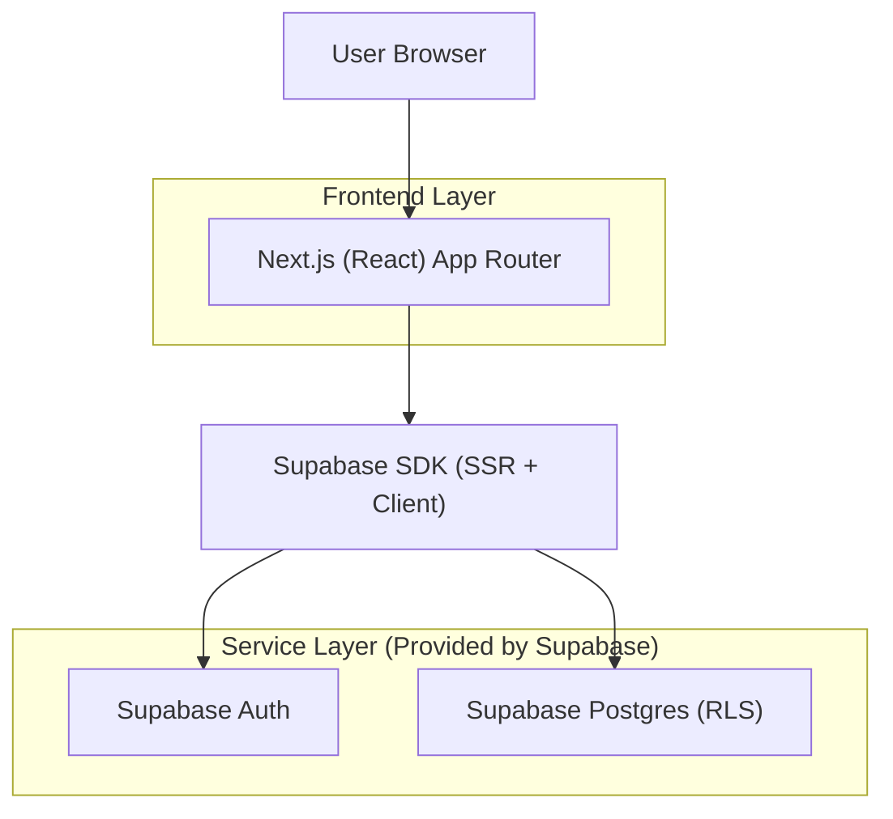
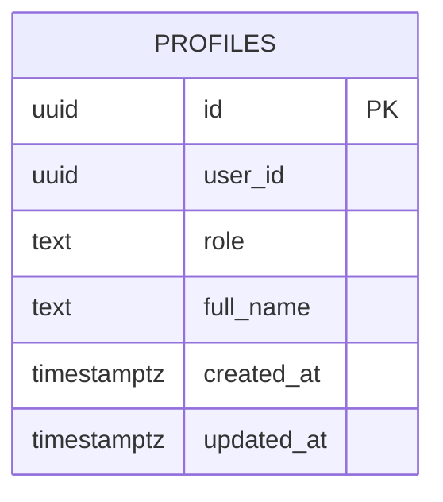

## 1.Architecture design


## 2.Technology Description
- Frontend: Next.js@15 (React@18/19) + TypeScript + App Router
- Backend: Supabase (Auth + Postgres)
- Supabase client: `@supabase/supabase-js` y utilidades SSR (`@supabase/ssr` o equivalente) para lectura de sesión en Server Components/Middleware

## 3.Route definitions
| Route | Purpose |
|-------|---------|
| / | Página de inicio: estado de sesión y CTAs a login/registro; muestra rol si está autenticado. |
| /login | Inicio de sesión con email/password y redirección posterior. |
| /registro | Registro de usuario y explicación de confirmación (si aplica). |

## 6.Data model(if applicable)

### 6.1 Data model definition


### 6.2 Data Definition Language
Profiles (profiles)
```sql
-- Nota: evitar FK físico; user_id es FK lógica a auth.users.id
CREATE TABLE IF NOT EXISTS public.profiles (
  id UUID PRIMARY KEY DEFAULT gen_random_uuid(),
  user_id UUID UNIQUE NOT NULL,
  role TEXT NOT NULL DEFAULT 'paciente' CHECK (role IN ('admin','alumno','paciente')),
  full_name TEXT,
  created_at TIMESTAMPTZ NOT NULL DEFAULT now(),
  updated_at TIMESTAMPTZ NOT NULL DEFAULT now()
);

CREATE INDEX IF NOT EXISTS idx_profiles_user_id ON public.profiles(user_id);
CREATE INDEX IF NOT EXISTS idx_profiles_role ON public.profiles(role);

ALTER TABLE public.profiles ENABLE ROW LEVEL SECURITY;

-- Función helper: comprobar si el usuario actual es admin (evita duplicar lógica en policies)
CREATE OR REPLACE FUNCTION public.is_admin(uid UUID)
RETURNS BOOLEAN
LANGUAGE sql
SECURITY DEFINER
SET search_path = public
AS $$
  SELECT EXISTS (
    SELECT 1 FROM public.profiles p
    WHERE p.user_id = uid AND p.role = 'admin'
  );
$$;

-- RLS: el usuario autenticado puede ver su propio perfil
CREATE POLICY profiles_select_own
ON public.profiles
FOR SELECT
TO authenticated
USING (user_id = auth.uid());

-- RLS: el usuario autenticado puede actualizar su propio perfil (no rol)
CREATE POLICY profiles_update_own
ON public.profiles
FOR UPDATE
TO authenticated
USING (user_id = auth.uid())
WITH CHECK (user_id = auth.uid() AND role = role);

-- RLS: admin puede leer todos los perfiles
CREATE POLICY profiles_admin_select_all
ON public.profiles
FOR SELECT
TO authenticated
USING (public.is_admin(auth.uid()));

-- RLS: admin puede actualizar perfiles (incluyendo role)
CREATE POLICY profiles_admin_update_all
ON public.profiles
FOR UPDATE
TO authenticated
USING (public.is_admin(auth.uid()))
WITH CHECK (true);

-- Permisos recomendados (ajusta según tu setup)
GRANT SELECT ON public.profiles TO anon;
GRANT ALL PRIVILEGES ON public.profiles TO authenticated;
```

Trigger: crear profile al registrarse
```sql
CREATE OR REPLACE FUNCTION public.handle_new_user()
RETURNS trigger
LANGUAGE plpgsql
SECURITY DEFINER
SET search_path = public
AS $$
BEGIN
  INSERT INTO public.profiles (user_id, role)
  VALUES (NEW.id, 'paciente')
  ON CONFLICT (user_id) DO NOTHING;
  RETURN NEW;
END;
$$;

DROP TRIGGER IF EXISTS on_auth_user_created ON auth.users;
CREATE TRIGGER on_auth_user_created
AFTER INSERT ON auth.users
FOR EACH ROW EXECUTE FUNCTION public.handle_new_user();
```
