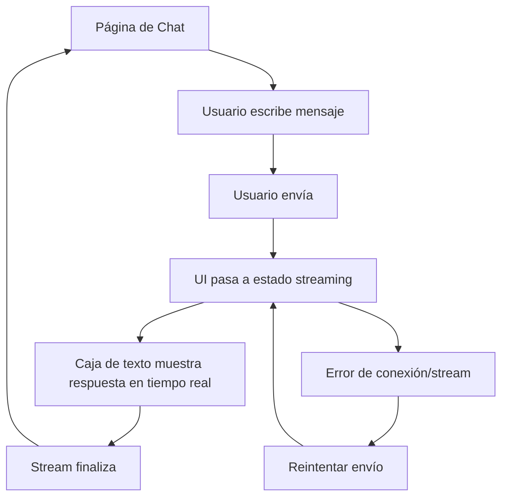

## 1. Product Overview
Aplicación web con frontend totalmente responsivo que permite enviar un mensaje a un asistente y ver, en una caja de texto dedicada, la respuesta del asistente en tiempo real mientras se va generando.
Enfocada en una experiencia de lectura clara, estable y rápida tanto en desktop como en móvil.

## 2. Core Features

### 2.1 Feature Module
Los requisitos del producto consisten en las siguientes páginas principales:
1. **Página de Chat**: layout responsivo, entrada de usuario, caja de texto con respuesta del asistente en tiempo real, estados de carga/error.

### 2.2 Page Details
| Page Name | Module Name | Feature description |
|-----------|-------------|---------------------|
| Página de Chat | Layout responsivo | Adaptar el layout a desktop/tablet/móvil manteniendo legibilidad, jerarquía y controles accesibles. |
| Página de Chat | Entrada de mensaje | Capturar texto del usuario y permitir enviar (botón y tecla Enter). |
| Página de Chat | Caja de texto del asistente (tiempo real) | Mostrar la respuesta del asistente incrementalmente a medida que llega el stream; mantener el contenido visible y actualizable sin recargar la página. |
| Página de Chat | Estado de interacción | Indicar estados: listo, enviando, recibiendo (streaming), finalizado; bloquear/desbloquear controles según corresponda. |
| Página de Chat | Manejo de errores básicos | Mostrar error si falla la conexión o el stream; permitir reintentar el envío del último mensaje. |

## 3. Core Process
Flujo principal (usuario):
1. Abres la Página de Chat y ves el campo de entrada y la caja de texto del asistente vacía o con el último resultado.
2. Escribes tu mensaje y lo envías.
3. La interfaz entra en estado “recibiendo” y la caja de texto del asistente se actualiza en tiempo real conforme llegan fragmentos del texto.
4. Al terminar el stream, el estado cambia a “finalizado” y puedes enviar un nuevo mensaje.
5. Si ocurre un error de red/servidor, se muestra un mensaje de error y puedes reintentar.

