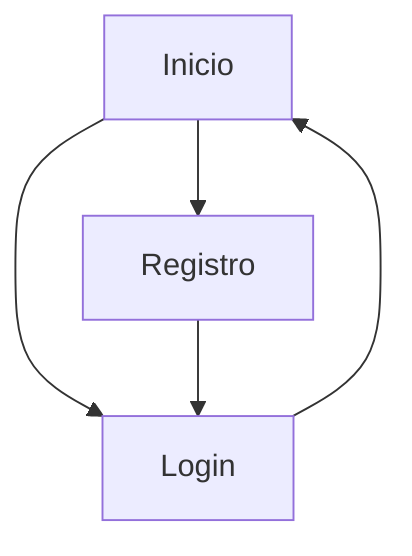

## 1. Product Overview
Autenticación en una app Next.js (App Router) con registro e inicio de sesión, y control de acceso por roles **Admin / Alumno / Paciente**.
Define una tabla `profiles` con RLS y un trigger para crear el perfil al registrarse.

## 2. Core Features

### 2.1 User Roles
| Rol | Método de registro | Permisos principales |
|-----|---------------------|----------------------|
| Paciente | Registro estándar (/registro) | Acceder a la app según su rol; ver/editar su propio perfil (datos básicos). |
| Alumno | Registro estándar (/registro) o asignación por Admin | Acceder a la app según su rol; ver/editar su propio perfil (datos básicos). |
| Admin | Asignación manual (DB/Consola) o seed inicial | Ver perfiles de todos; cambiar roles; administrar reglas de acceso (a nivel de datos) vía RLS. |

### 2.2 Feature Module
La app requiere las siguientes páginas principales:
1. **Inicio**: entrada al producto, CTAs a login/registro, estado de sesión (logueado/no), resumen de rol actual.
2. **Login**: formulario de acceso, manejo de errores, redirección post-login según rol.
3. **Registro**: creación de cuenta, validaciones, creación automática de `profiles` vía trigger, confirmación de email (si aplica) y redirección.

### 2.3 Page Details
| Page Name | Module Name | Feature description |
|-----------|-------------|---------------------|
| Inicio | Estado de sesión | Mostrar si hay sesión activa; exponer email y rol (desde `profiles`) cuando aplica. |
| Inicio | Acciones principales | Navegar a /login y /registro cuando no hay sesión; cerrar sesión cuando hay sesión. |
| Inicio | Control por rol (UI) | Mostrar secciones/acciones de ejemplo según rol (Admin/Alumno/Paciente) sin crear nuevas rutas. |
| Login | Formulario | Autenticar con email + password; validar campos; mostrar errores de credenciales. |
| Login | Redirección por rol | Tras login exitoso, obtener `profiles.role` y redirigir (o ajustar UI) según rol. |
| Login | Recuperación de sesión | Mantener sesión mediante cookies; rehidratar estado al recargar. |
| Registro | Formulario | Registrar con email + password; validar campos; mostrar errores comunes (email en uso, password débil). |
| Registro | Creación de perfil | Crear automáticamente un registro en `profiles` mediante trigger al crear usuario en Auth. |
| Registro | Confirmación | Informar estado (confirmación de email si está habilitada) y permitir ir a /login. |

## 3. Core Process
**Flujo de usuario (Paciente/Alumno)**
1) Entra a **Inicio** → elige **Registro** o **Login**.
2) En **Registro**, crea cuenta (email/password). Al registrarse, se crea un `profiles` con rol por defecto (p.ej. `paciente`).
3) En **Login**, inicia sesión. La app consulta `profiles` para leer el rol y habilitar el acceso/experiencia correspondiente.
4) Desde **Inicio**, puede cerrar sesión.

**Flujo de Admin**
1) Inicia sesión en **Login**.
2) La app identifica rol `admin` desde `profiles`.
3) Puede ver/gestionar perfiles (capacidad definida por RLS; la UI puede estar en Inicio o en componentes internos).

